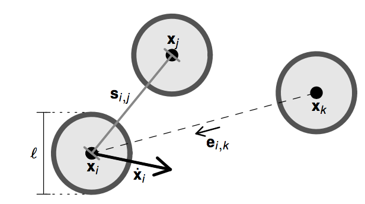
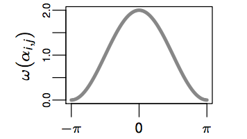
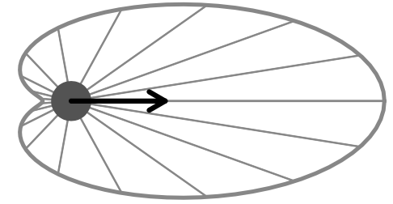
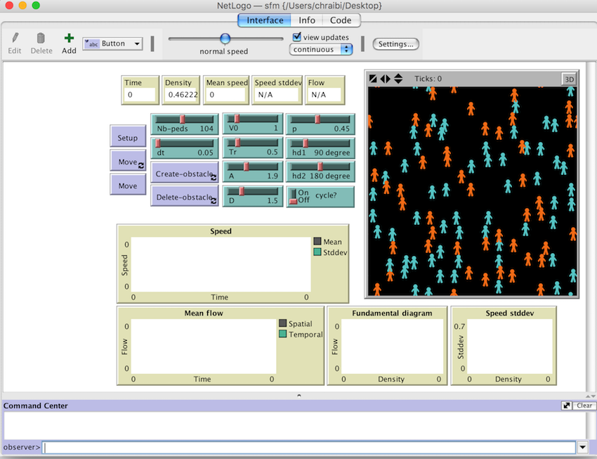

# Social Force Model (Helbing 1995)

## Equation of motion

## Usage 

- Download [NetLogo](https://ccl.northwestern.edu/netlogo/download.shtml) and open the nlogo-file.
- Adapt the number of agents `Nb-peds` and click on `Setup`
- `Move` to start the simulation

You can change the parameters while the simulation is running. However, when the number of agents is changes, you need to `Setup` again.

## Credits

Antoine Tordeux (tordeux@uni-wuppertal.de)
